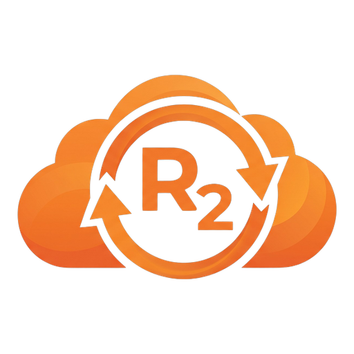

<p align="center">
  
</p>

<h1 align="center">r2sync</h1>

<p align="center">
  <strong>Native, Private, Open-Source Backup & Multi-PC Cloud Synchronization for Cloudflare R2</strong>
</p>

---

## 🌟 Key Features

* **Bidirectional Multi-PC Sync**: Continuously synchronize folders across your desktop, laptop, and work computers through Cloudflare R2.
* **Direct & Private**: Communicates directly from your machines to Cloudflare R2 S3 endpoints (`https://<account_id>.r2.cloudflarestorage.com`). No third-party relays or telemetry.
* **Asynchronous Offline Tolerance**: Computers do not need to be online simultaneously. R2 acts as the persistent cloud sync and storage layer.
* **Deterministic Conflict Center**: Safe conflict resolution with automated non-destructive conflict copies `filename (conflict - <Device> - <Date>).ext` and 1-click Keep Local / Keep Remote / Keep Both resolution.
* **Mass Deletion Protection**: A deletion ceiling expressed as a file count (e.g. max 50 deletes) that automatically pauses sync and alerts the user if catastrophic deletes occur. Emptying an entire synchronized folder is always held for confirmation, because an unmounted drive is indistinguishable from a deliberate wipe.
* **Real-Time Change Watching**: Native Windows `ReadDirectoryChangesW` filesystem watcher (overlapped I/O, per-path exclusion filtering, automatic polling fallback) with event coalescing and debouncing. Changes that land while a sync is already running are queued into a follow-up run rather than dropped.
* **Survives Reboots Without the GUI**: The background service registers itself for Windows logon startup, restores every enabled dataset's watcher on start, and reconciles anything that changed while the machine was off. The desktop window never needs to be open.
* **"Set Up This PC" Onboarding**: 1-click auto-discovery of shared datasets on Cloudflare R2 when setting up new computers.
* **Device Identity Management**: Secure local UUID generation and user-friendly computer naming without collecting hardware serial numbers or MAC addresses.
* **Modern PySide6 GUI**: 6-view layout (Dashboard, Backups, Sync, Activity, Storage, Settings), system tray integration, and dark/light themes.
* **Independent Background Service**: Runs as a background Windows service or daemon with local JSON-RPC IPC and automatic retry logic.
* **Hardened Security**: Credentials stored exclusively in native Windows Credential Manager / DPAPI. Passed to Rclone in-memory without plain-text config files on disk.
* **Tuned in Both Directions**: Speed profiles configure upload concurrency *and* parallel download streams
  (`--multi-thread-streams` / `--multi-thread-cutoff`), so pulling data back from R2 is not limited to a single
  connection. Downloads stay atomic (`.partial` + rename) so an interrupted transfer never corrupts a local file.
* **Honest Progress**: While rclone is still enumerating, the UI reports `Scanned / Discovered`; once the transfer
  queue is complete it switches to a real `Transferred / Total` with a trustworthy percentage, speed and ETA.
* **Zero Egress Fees**: Cloudflare R2 charges $0 for egress bandwidth, making continuous multi-PC synchronization extraordinarily cost-effective.

---

## 🏗️ Multi-PC Synchronization Architecture

```text
                           Cloudflare R2
                   (Persistent Sync & Data Layer)
                                │
                 ┌──────────────┴──────────────┐
                 │                             │
          (HTTPS / S3 API)              (HTTPS / S3 API)
                 │                             │
          +------v-------+              +------v-------+
          |  Desktop-PC  |              |  Laptop-PC   |
          |  (Offline/On)|              |  (Offline/On)|
          +--------------+              +--------------+
```

### R2 Dataset Namespace Layout
Each synchronized folder is isolated under a versioned, collision-proof namespace in your R2 bucket:
```text
r2sync/v1/datasets/<dataset_id>/
├── metadata/
│   └── dataset.json               # Name, creation timestamp, protocol version, schema
├── devices/
│   ├── <device_id_1>.json         # Device heartbeat, status, last sync timestamp
│   └── <device_id_2>.json
└── data/                          # The synchronized logical filesystem tree
```

---

## 🔒 Security & Privacy Model

* **Zero Developer Servers**: `r2sync` communicates only with Cloudflare R2.
* **Native DPAPI / Keyring**: Cloudflare Account ID, Access Key ID, and Secret Access Key are encrypted by Windows DPAPI.
* **Ephemeral In-Memory Credentials**: Rclone processes are invoked with memory-passed environment variables (`RCLONE_CONFIG_R2_*`). No plaintext `rclone.conf` is saved to disk.
* **Safe Operations**: Disconnecting a computer or uninstalling `r2sync` NEVER deletes remote Cloudflare R2 dataset files.

---

## 📁 Application Data Paths

Mutable application data is stored in standard OS app data directories:
```text
%LOCALAPPDATA%\r2sync\
├── database.sqlite      # SQLite database (backup jobs, sync datasets, conflicts, history)
├── bisync\              # Per-dataset bisync state and file listings
│   └── <dataset_id>\
├── recovery\            # Local trash / recovery copies for safety
├── logs\                # Structured application execution logs
├── rclone\              # Verified Rclone binary
├── state\               # Authenticated IPC tokens and service state
└── cache\               # Temporary transfer cache
```

---

## 🚀 Getting Started (Development & Running)

### Prerequisites
* Python 3.10+
* Windows 10/11 (or Linux/macOS for development)

### Setup & Testing
```bash
# Clone the repository
git clone https://github.com/saurabhhbansal/r2sync.git
cd r2sync

# Install package in editable mode with development dependencies
pip install -e .[dev]

# Run comprehensive test suite
pytest -v

# The end-to-end synchronization tests drive a real rclone binary against a
# local stand-in for R2. They skip automatically unless one is available:
#   R2SYNC_TEST_RCLONE=/path/to/rclone pytest -v tests/test_sync_e2e.py

# Launch GUI application
python -m r2sync.gui.main

# Launch background service
python -m r2sync.service.main --standalone
```

### Background Service & Windows Startup
Synchronization is performed by `r2sync-service`, not by the GUI. The installer's
*"Keep folders synchronized in the background after every restart"* task registers the
service under `HKCU\...\CurrentVersion\Run`, and the service re-registers itself on
every start. Opening the desktop app also launches the service if it is not already
running. The toggle lives in **Settings -> Application Preferences -> Background sync**.

---

## 📦 Open Source License Compliance

All dependencies used in `r2sync` are strictly compliant with open-source distribution:

| Dependency | License | Purpose |
| :--- | :--- | :--- |
| **PySide6 (Qt for Python)** | LGPL-3.0 | Native desktop GUI framework |
| **keyring** | MIT | Native OS Credential Vault integration |
| **requests** | Apache-2.0 | Cloudflare R2 S3 API communication |
| **psutil** | BSD-3-Clause | Process management and system telemetry |
| **Rclone** | MIT | High-performance multi-threaded sync & bisync engine |

---

## 📄 License

Distributed under the **MIT License**. See `LICENSE` for more information.
